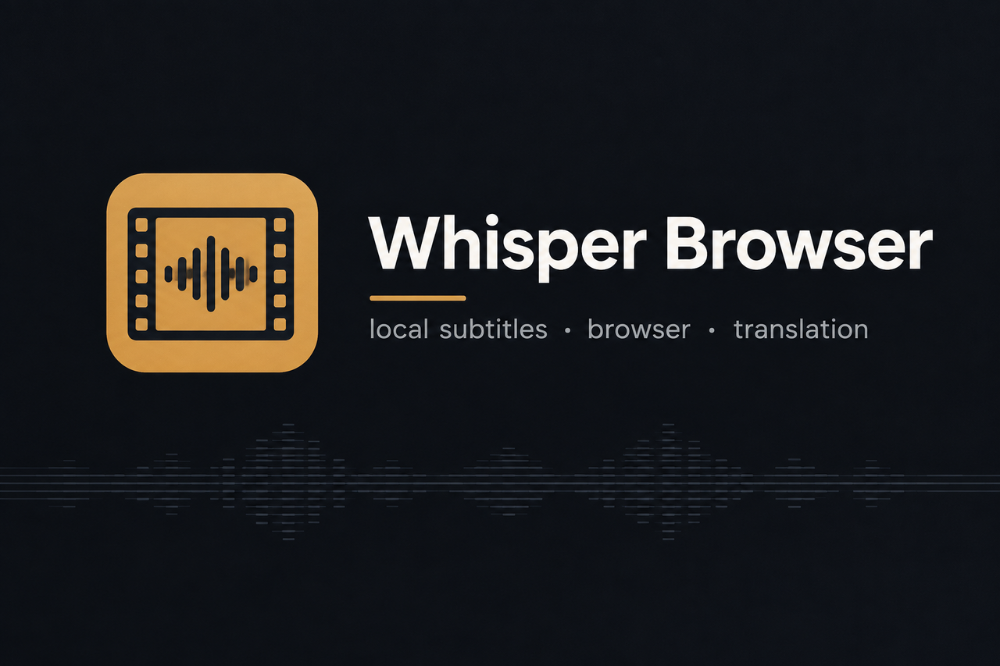
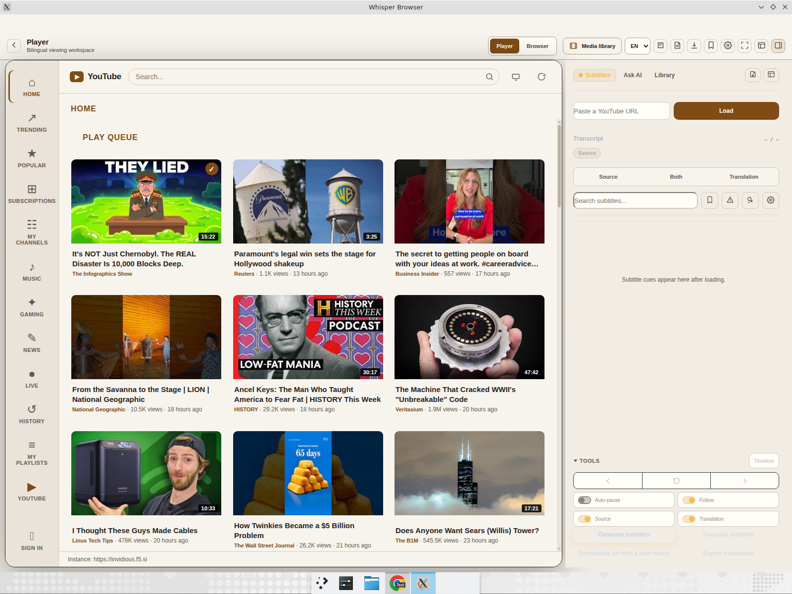
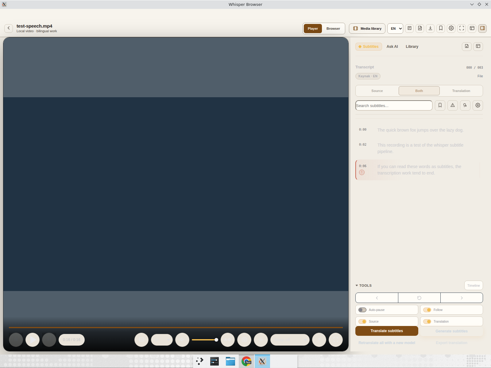

<div align="center">



**Local GPU-accelerated subtitles, a subtitle-aware video browser, and context-sensitive translation — all in one desktop workstation.**

[](https://github.com/dorukakindev/whisper-browser/actions/workflows/ci.yml)
[](LICENSE)


[Installation](docs/INSTALLATION.md) · [Usage guide](docs/USAGE_GUIDE.md) · [Architecture](docs/ARCHITECTURE.md) · [Privacy](docs/PRIVACY.md) · [Troubleshooting](docs/TROUBLESHOOTING.md)

</div>

---

Whisper Browser is a desktop application for turning media into working subtitles — entirely on your machine. Transcribe local files and YouTube with faster-whisper, watch video with source and translation tracks side by side, capture accessible subtitle tracks from websites in the embedded browser, and translate with timing preserved. The interface opens in English with an EN/TR switch; some older diagnostic messages are still Turkish while localization continues.

> **Beta** — back up important subtitle files and review generated text before publishing.

## Feature tour

| | |
| --- | --- |
| 🎬 **Player** | Watch local media with dual subtitles — cue search, click-to-seek transcript, editing, loops, notes, per-scene AI questions. |
| 🌐 **SmartTube home** | YouTube browsing built in: home/trending/popular feeds with thumbnails, subscriptions, playlists — sign in with a device code, no Google Cloud setup needed. |
| 🗣️ **Local transcription** | faster-whisper (or optional WhisperX) on CUDA, with automatic CPU fallback. SRT, VTT, ASS, TXT, JSON export. |
| 🧭 **Browser capture** | HLS/DASH, WebVTT, TTML/IMSC and text-track capture on sites that expose accessible subtitles — then translate or fall back to Live Whisper. |
| 🌍 **Context translation** | Cue timing never moves: context-aware translation writes a separate target file, source untouched. |
| 📄 **Page & PDF** | Articles, manga regions and bounded PDF batches translated via configured providers. |

Whisper Browser does not decrypt protected media, bypass DRM, or extract data from a CDM. Capture works only where a site exposes an authorized, accessible subtitle track.

## Screens



| Browser workspace | Context-aware AI | Player transcript |
| --- | --- | --- |
|  |  |  |
| Capture and inspect accessible web subtitle tracks. | Ask questions grounded in the current scene. | Transcription lands here — search, edit, correct. |

[](docs/media/whisper-browser-tour.mp4)

*26-second MP4: English source track + context-aware Turkish translation over [*Tears of Steel*](https://www.youtube.com/watch?v=OHOpb2fS-cM) (Blender Foundation, CC BY 3.0). Audio omitted on purpose; no account, key or history data included.*

## Ways to use it

| Workflow | Use it for |
| --- | --- |
| **Local file or folder** | GPU transcription, batch queues, subtitle repair, translation, SRT/VTT/ASS/TXT/JSON export. |
| **YouTube source mode** | A complete local subtitle file from a permitted YouTube video or selected time range. |
| **Player mode** | Source/translation tracks, cue search, editing, loops, notes, timing tools. |
| **Browser mode** | Watch websites, capture accessible tracks, retrieve full tracks where supported, translate — or Live Whisper. |
| **Page, manga & PDF** | Translate articles/selections, supported image regions, bounded PDF batches. |

## Quick start

Requirements: **Windows 10/11** (production target), Node.js 22.13+, Python 3.10–3.11, FFmpeg. NVIDIA CUDA recommended (CPU fallback is automatic).

```bat
git clone https://github.com/dorukakindev/whisper-browser.git
cd whisper-browser
install.bat        :: Linux/Ubuntu: ./install.sh
start.bat          :: Linux/Ubuntu: ./start.sh
```

Always launch via `start.bat`/`start.sh` — they configure the CUDA library paths. Default folders: `Downloads\Whisper\GİRDİ` → `Downloads\Whisper\ÇIKTI` (configurable).

**Platform notes:** the GUI, tests and the pinned Castlabs Electron runtime also run on Ubuntu 22.04+ for development/CI. DRM/VMP signature repair (`drm-kur.bat`), optional WhisperX/diarize installers and CUDA-tuned transcription are verified on Windows only; macOS is not a target.

## Development

```powershell
npm ci --ignore-scripts
node node_modules/electron/install.js --no   # Electron binary for smokes
python3.11 -m venv backend/venv
backend/venv/bin/pip install -r backend/requirements-ci.txt
npm test
npm run test:electron-bridge                  # real Electron bridge smoke
node --check src/main.js; node --check src/preload.js; node --check src/renderer/renderer.js
python -m py_compile backend/transcribe.py backend/media.py
```

`npm test` runs Node and Python suites; Python side needs `backend/venv` (or `WHISPER_TEST_PYTHON`). `requirements-ci.txt` pins need Python 3.11 (same as CI); production supports 3.10–3.11. On Windows use `venv\Scripts\pip.exe`.

Transcription is local. Optional online flows are documented in [Privacy](docs/PRIVACY.md); secrets never travel in command-line args and supported credentials use Electron safeStorage.

## Docs

- [Installation](docs/INSTALLATION.md) · [Usage guide](docs/USAGE_GUIDE.md) · [Architecture](docs/ARCHITECTURE.md)
- [Privacy](docs/PRIVACY.md) · [Troubleshooting](docs/TROUBLESHOOTING.md) · [Changelog](CHANGELOG.md)
- [Contributing](CONTRIBUTING.md) · [Support](SUPPORT.md) · [Security](SECURITY.md) · [Code of Conduct](CODE_OF_CONDUCT.md) · [Third-party notices](THIRD_PARTY_NOTICES.md)

Historical audit/handoff records under `docs/` are evidence, not current product documentation.

---

<div align="center">
<sub>MIT licensed · dependencies keep their own licenses · you're responsible for applicable law, service terms and content rights.</sub>
</div>
