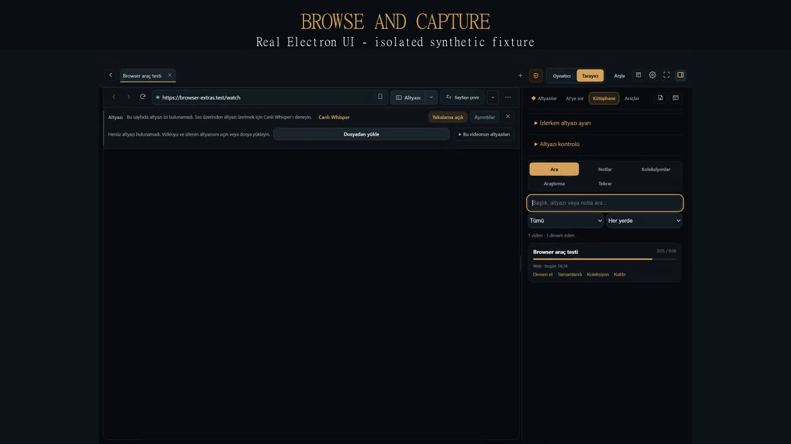
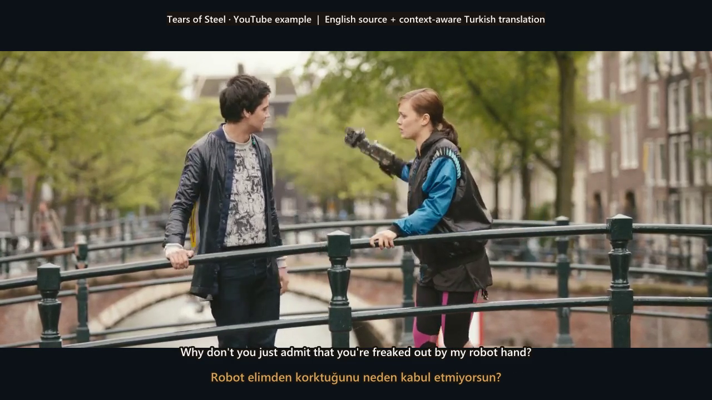
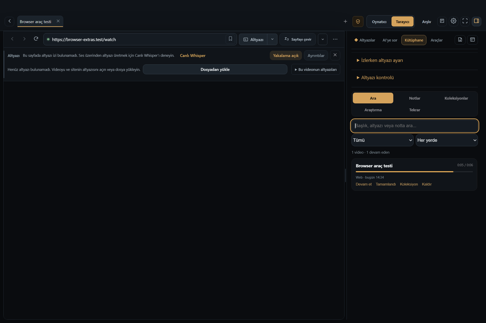
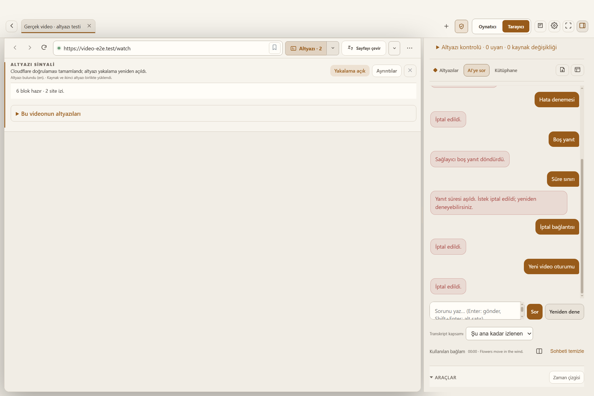
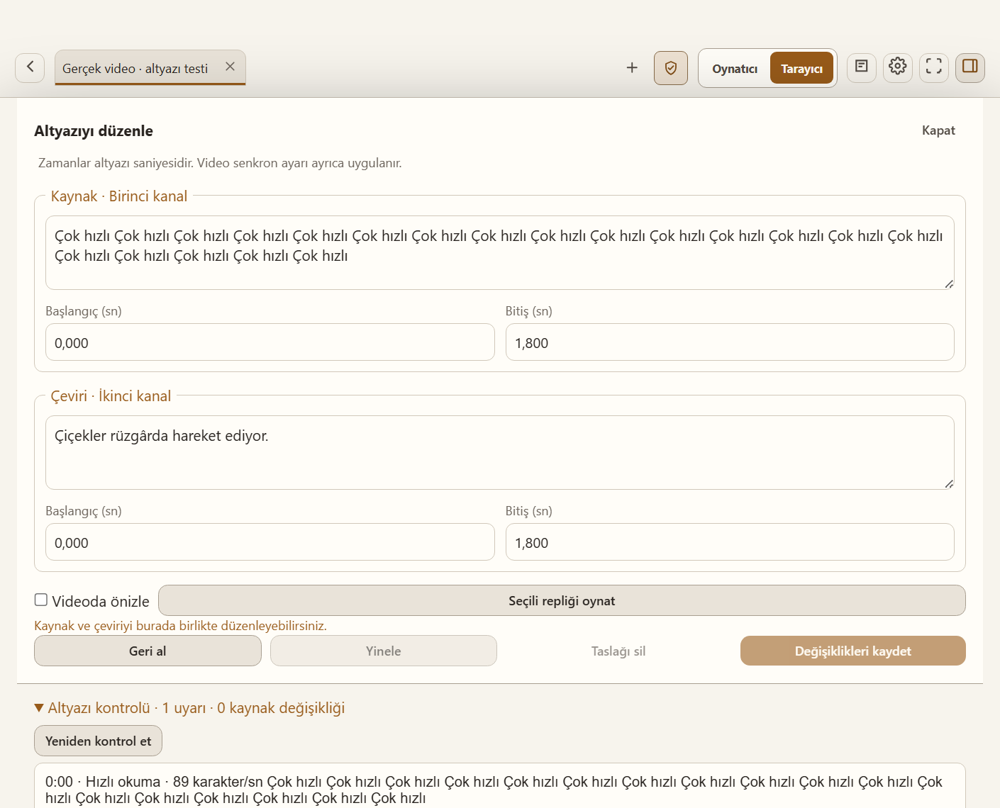

# Whisper Browser

   

Whisper Browser is a Windows desktop application for local GPU-accelerated subtitle transcription, subtitle-aware video browsing, and context-sensitive translation. The application UI is currently in Turkish.

> This project is in beta. Back up important subtitle files and review generated text before publishing it.

## Highlights

- Local media and YouTube transcription with faster-whisper or optional WhisperX
- SRT, VTT, ASS, TXT, and JSON output
- Context-aware translation that preserves cue timing
- Local and embedded-browser playback with dual subtitles
- HLS/DASH, WebVTT, TTML/IMSC, and browser text-track capture
- Editing, synchronization, search, queues, watch folders, and diagnostics
- Optional Widevine-capable Castlabs Electron for authorized playback

Whisper Browser does not decrypt protected media, bypass DRM, or extract data from a CDM. Capture works only when a site exposes an authorized, accessible subtitle track.

## Product tour

Click the image to open a 26-second MP4 showing an English subtitle track and a context-aware Turkish translation over real video. The public example uses [*Tears of Steel* on YouTube](https://www.youtube.com/watch?v=OHOpb2fS-cM), an open movie by Blender Foundation.

| Browser workspace | Context-aware AI | Subtitle editor |
| --- | --- | --- |
|  |  |  |
| Capture and inspect accessible web subtitle tracks. | Ask questions grounded in the current scene. | Correct text without losing cue identity or timing. |

The application captures use isolated test profiles and synthetic fixtures. The real-video demo uses a credited excerpt from *Tears of Steel* (CC BY 3.0) with a manually reviewed Turkish translation; audio is intentionally omitted. No user account, private subtitle, API key, or browsing-history data is included.
## Setup

Requirements: Windows 10/11, Node.js 22.13+, Python 3.10 or 3.11, and FFmpeg. An NVIDIA CUDA GPU is recommended.

    git clone https://github.com/dorukakindev/whisper-browser.git
    cd whisper-browser
    install.bat
    start.bat

Use start.bat so CUDA DLL paths are configured. Default input/output folders are %USERPROFILE%\Downloads\Whisper\GİRDİ and %USERPROFILE%\Downloads\Whisper\ÇIKTI; both are configurable.

## Documentation

- [Installation](docs/INSTALLATION.md)
- [Architecture](docs/ARCHITECTURE.md)
- [Privacy](docs/PRIVACY.md)
- [Troubleshooting](docs/TROUBLESHOOTING.md)
- [Contributing](CONTRIBUTING.md)
- [Support](SUPPORT.md)
- [Security](SECURITY.md)
- [Code of Conduct](CODE_OF_CONDUCT.md)
- [Changelog](CHANGELOG.md)
- [Third-party notices](THIRD_PARTY_NOTICES.md)

Historical audit and handoff records under docs/ are evidence, not current product documentation.

## Development

    npm ci --ignore-scripts
    npm test
    node --check src/main.js
    node --check src/preload.js
    node --check src/renderer/renderer.js
    python -m py_compile backend/transcribe.py backend/media.py

Transcription is local. Optional online data flows are documented in [Privacy](docs/PRIVACY.md). Secrets are not passed in command-line arguments and supported credentials use Electron safeStorage when OS protection is available.

Original project code is [MIT licensed](LICENSE). Dependencies retain their own licenses. Users are responsible for applicable law, service terms, and content rights.
