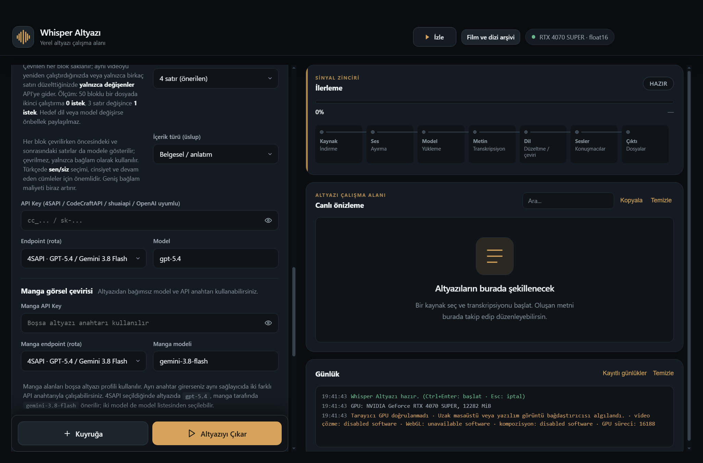

# Usage guide

Whisper Browser combines several workflows in one Windows application. The interface is currently Turkish; this English guide includes the Turkish control names in parentheses so you can locate them quickly.

## Choose the right workflow

| Goal | Start here | What happens |
| --- | --- | --- |
| Transcribe a local video or audio file | **File** (`Dosya`) | Local Whisper creates timed subtitles; optional translation, speaker labeling, cleanup, and export run afterwards. |
| Transcribe a YouTube video | **YouTube** source tab | yt-dlp retrieves the selected video or clip, then the local Whisper pipeline creates subtitles. |
| Watch a local video with one or two subtitle tracks | **Player** (`Oynatıcı`) | Load source and translated subtitles, search cues, edit text, loop sections, and keep timing attached to the media. |
| Watch a website and capture its accessible captions | **Browser** (`Tarayıcı`) | The application observes accessible TextTrack, HLS, DASH, WebVTT, TTML/IMSC, JSON3, and supported embedded-caption paths. |
| A website has no accessible caption track | **Live Whisper** (`Canlı Whisper`) | Audio transcription is the fallback. It is not as complete or deterministic as retrieving the site's full subtitle track. |
| Translate an article, a selection, or a whole page | **Translate page** (`Sayfayı çevir`) | Choose article, whole-page, or selected-text scope and display source, translation, or both. |
| Translate manga or webtoon images | **Manga** | OCR and image translation place editable translated regions over supported page images. |
| Read and translate a PDF | PDF button in the player header | Open the local PDF reader, translate selected page batches, and export available translated pages. |

The application does not decrypt protected media or bypass DRM. Browser caption capture works only when the site exposes an authorized, accessible track. Site changes, authentication, regional restrictions, and unsupported formats can affect capture.

## 1. Local files

1. Open the **File** (`Dosya`) source tab.
2. Drop a video/audio file, choose files, or choose a folder. Multiple items can be queued.
3. Select the Whisper model, language, segmentation, output formats, and optional translation settings.
4. Start the job. Progress, live segments, warnings, and output files appear in the main workspace.
5. Open the result in the player to review source and translation together. Editing a cue preserves its identity and timing.

Outputs can include SRT, VTT, ASS, TXT, and JSON. The default input/output folders are `%USERPROFILE%\Downloads\Whisper\GİRDİ` and `%USERPROFILE%\Downloads\Whisper\ÇIKTI`; both are configurable.

## 2. YouTube: two different routes

### Route A — create a complete subtitle file

Use the **YouTube** source tab when you want a normal transcription job and output files:

1. Paste a YouTube watch URL.
2. Optionally set a start and end time. Cue timestamps remain relative to the original video timeline.
3. Leave browser-session use disabled unless the video genuinely needs an existing local browser session.
4. Choose **transcription only** or enable translation, then start the job.

This route downloads the permitted media through yt-dlp and processes the audio locally. It is usually the better choice when you need a complete SRT rather than only the captions seen during playback.

### Route B — watch and translate in the embedded browser

Use **Player → Browser** when you want to watch the site directly:

1. Open the browser workspace and navigate to the video.
2. Start playback and enable the site's caption language.
3. Keep **Capture on** (`Yakalama açık`). Open **This video's subtitles** (`Bu videonun altyazıları`) to inspect discovered tracks.
4. Select a source track and choose translate. When a full track can be retrieved, use the complete-track action instead of waiting for live cues.
5. Use **Details** (`Ayrıntılar`) when capture is incomplete; it reports acquisition paths, counts, and redacted errors.

The image links to a silent 26-second real-video tour using Blender Foundation's *Tears of Steel*. The English source cue is shown with its reviewed Turkish translation.

## 3. Browser workspace and web subtitles

The browser workflow prefers the site's existing subtitle data because it normally has better coverage and timing than live speech recognition. Discovery can use browser text tracks, network responses, manifests, and supported embedded-caption paths. If no accessible track exists, use Live Whisper as a deliberate fallback.

Useful browser actions include:

- source/translation/dual subtitle display;
- track selection, complete-track retrieval, translation, export, and diagnostics;
- subtitle search, cue navigation, timing adjustment, A–B loop, cue loop, auto-pause, and gap policies;
- page translation, reader view, manga translation, PDF reader, bookmarks/history, downloads, notes, and media diagnostics;
- authorized playback in the embedded browser, without DRM circumvention.

## 4. Translate subtitles with context

Subtitle translation is not performed as an isolated word-for-word lookup. The pipeline can group related cues, send surrounding context, preserve cue-local numbers and names, apply terminology, retry failed blocks, and restore the result to the original cue timeline. Translation integrity still depends on the provider and model, so review warnings and final cue counts.

Provider settings are stored per provider: switching provider restores that provider's saved key and model instead of requiring the key every time. Subtitle and manga translation may use separate profiles.

Never commit or share a screenshot containing a real API key. Provider calls send the selected text, context, image regions, or questions to the configured external service; see [Privacy](PRIVACY.md).

## 5. Translate pages, manga, and PDFs

### Web pages

In the browser toolbar, choose **Translate page** (`Sayfayı çevir`). The quick menu can select:

- translated text only, source only, or both;
- article, full-page, or selected-text scope;
- target language and character budget;
- optional automatic translation for the current site.

Dynamic pages can change while translation is running. The application rejects stale results, but you should still verify long or frequently changing pages.

### Manga and webtoons

Choose **Manga** on a supported reading page. Configure target language, request concurrency, maximum images, font scale, vertical text, and SFX styling. Translated bubbles can be edited, failed regions retried, and results exported as image or JSON. OCR quality depends on image quality, layout, font, and provider vision support.

### PDFs

Open the PDF reader from the player header. PDF translation works in bounded page batches and requires a configured translation provider. Source PDFs remain local, while extracted text sent for translation follows the selected provider's privacy policy.

## 6. AI, notes, and review

The AI panel can use the current media, active cue, nearby subtitle context, and saved notes. Treat generated explanations as assistance rather than source evidence. The subtitle editor and diagnostics remain the authoritative places to verify timing and coverage.

## 7. Translation checklist

Before considering a job complete:

1. Compare source and translated cue counts.
2. Check the visible integrity warning count and failed-block status.
3. Spot-check names, numbers, negation, and scene context.
4. Seek through several distant timestamps to confirm synchronization.
5. Export the translation and reopen it once before deleting any source file.

For failures, see [Troubleshooting](TROUBLESHOOTING.md). When opening an issue, use a synthetic example and remove keys, cookies, signed URLs, personal paths, and copyrighted subtitle text.
